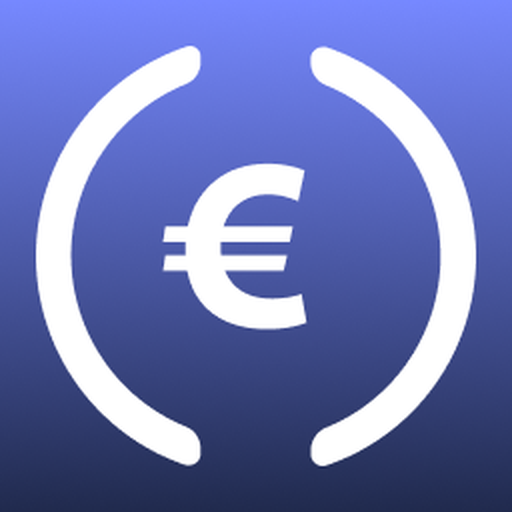

# Europa Coin (EURC)

**Europa Coin (EURC)** is a next-generation utility token for active traders, liquidity providers, and DeFi platforms on the BNB Smart Chain (BSC).  
EURC is not a stablecoin—its value is determined by open market trading.

## Key Details

- **Symbol:** EURC
- **Contract Address:** [`0x80803EB10D5566C93EE90202c4bA520341814489`](https://bscscan.com/token/0x80803EB10D5566C93EE90202c4bA520341814489)
- **Decimals:** 18
- **Max Supply:** 10,000,000,000 EURC
- **Website:** [https://eurc.online](https://eurc.online)
- **Twitter:** [@eurconline](https://x.com/eurconline)
- **Telegram:** [t.me/eurconline](https://t.me/eurconline)

## Description

Europa Coin (EURC) is designed for rapid trading, low-fee transactions, and flexible use across DeFi, exchanges, and the broader crypto ecosystem.  
EURC is a capped-supply, market-driven asset, not pegged to fiat or other currencies.

## Resources

- **Explorer:** [BscScan EURC](https://bscscan.com/token/0x80803EB10D5566C93EE90202c4bA520341814489)
- **Logo:** 
- **info.json:** [info.json](info.json)
- **Whitepaper:** [docs/whitepaper.pdf](docs/whitepaper.pdf) (if available)

## Contracts

- `contracts/EURC.sol` — Main ERC20 contract source

## Getting Started

Clone this repository and review the contract, metadata, and resources.
Deployments and updates will be announced via [Twitter](https://x.com/eurconline) and [Telegram](https://t.me/eurconline).

## License

MIT

---

**Disclaimer:** EURC is a market-driven utility token. Please review all documentation and understand risks before participating.
